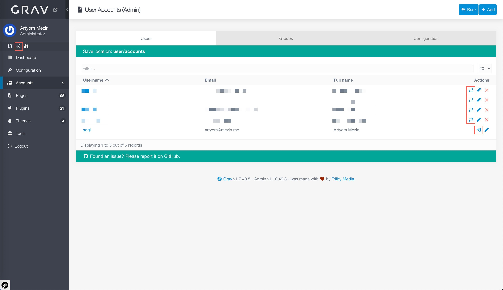

Русский | [English](README.md)

# Плагин Impersonate

Плагин для Grav, который позволяет администратору открывать фронтенд-сессию от лица пользователя (или от своего имени) в один клик из админки, не трогая текущую админ-сессию.



## Возможности

- **Impersonate из админки**:
  - Кнопка действия “Impersonate” в списке пользователей (шаблон спроектирован так, чтобы работать и с Flex и с default storage).
  - Кнопка в Quick Tray “Impersonate Self” для открытия фронта под текущим админом.
- **Корректное завершение impersonate**:
  - Отдельный endpoint остановки `/impersonate/stop` (только `POST` + nonce).
  - Действие “Stop” доступно из Quick Tray и из списка пользователей (одна toggle-кнопка).

- **Усиленная безопасность**:
  - Одноразовые, подписанные HMAC токены с коротким TTL и хранением только хэша на диске.
  - CSRF-защита для admin task-ов и stop endpoint.
  - Запрет impersonate в админов по умолчанию (с явным override при необходимости).
- **Синхронизация в реальном времени**:
  - Внедряет легкий JS-скрипт на фронтенде.
  - Мгновенно обновляет иконки в админке (старт/стоп) между вкладками через `BroadcastChannel` без перезагрузки.
- **Логи**:
  - Отдельный аудит-лог `logs/impersonate.log` с понятными событиями.

## Требования

- Grav **1.7.0+** (см. `blueprints.yaml`).
- Установленный Grav Admin.
- **Разделённые сессии**: Требуется `system.session.split: true` (Админ-сессия и фронтенд-сессия живут независимо; impersonate влияет только на фронт).

Успешно протестировано с Grav **v1.7.49.5** — Admin **v1.10.50**.

## Установка

### Через GPM (рекомендуется)

В корне установки Grav:

```bash
bin/gpm install impersonate
```

Плагин будет установлен в `user/plugins/impersonate`.

### Ручная установка

1. Скачайте ZIP-архив репозитория.
2. Распакуйте в `user/plugins/` и при необходимости переименуйте папку в `impersonate`.
3. В итоге структура должна быть:

   ```text
   user/plugins/impersonate
   ```

### Через Admin-плагин

В админке Grav откройте **Plugins → Add** и найдите `Impersonate`.

## Конфигурация

Скопируйте файл конфигурации по умолчанию:

```text
user/plugins/impersonate/impersonate.yaml
```

в:

```text
user/config/plugins/impersonate.yaml
```

и редактируйте уже копию.

Конфиг по умолчанию:

```yaml
enabled: true
allow_admin_targets: false
token_ttl_seconds: 45
default_redirect: /
log_events: true
show_ui_button: true
confirm_on_switch: true
icon_start: fa-arrow-right-arrow-left
icon_stop: fa-arrow-right-from-bracket
icon_self: fa-arrow-right-to-bracket
```

Ключевые опции:

- **`allow_admin_targets`**  
  Разрешить impersonate в аккаунты с `admin.login` / `admin.super`.  
  По умолчанию: `false` (для продакшена так и оставлять).

- **`token_ttl_seconds`**  
  Время жизни одноразового токена (в секундах).  
  По умолчанию: `45`.

- **`default_redirect`**  
  Путь фронта, куда редиректить после успешного impersonate/stop.  
  Должен быть внутренним путём, начинаться с `/`.

- **`log_events`**  
  Включить/выключить аудит-лог `logs/impersonate.log`.

- **`show_ui_button`**  
  Показ/скрытие интеграции в админке (Quick Tray + кнопки в списке пользователей).

- **`confirm_on_switch`**  
  Показывать модалку-подтверждение при переключении impersonate с одного пользователя на другого.

- **`icon_start`, `icon_stop`, `icon_self`**  
  Кастомные CSS-классы Font Awesome 7 для иконок в админке.

## Безопасность

### Модель сессий

- Требуется `system.session.split: true`.
- Админ-сессия никогда не переиспользуется под фронт; impersonate меняет только фронт.

### Токены

- Токены подписаны HMAC с использованием сильного секрета:
  - `IMPERSONATE_TOKEN_SECRET` (env), иначе
  - `system.security.salt` (если достаточно длинный).
- В payload входят:
  - `actor_user`, `target_user`, `mode`, `iat`, `exp`, `nonce`, `action`.
- Гарантируется:
  - короткий TTL (`token_ttl_seconds`),
  - одноразовость (server-side `used_at` + сверка nonce),
  - на диск пишется только **хэш** токена, не сам токен.

### Admin task-и

- Все admin task-и (`impersonate`, `impersonateSelf`, `stopImpersonate`, лог-эндпоинты) требуют валидного nonce `admin-form`.
- Права:
  - `admin.impersonate.self`
  - `admin.impersonate.users`
  - `admin.impersonate.logs`
  - `admin.super` всегда может запускать и останавливать impersonate.

### Stop-эндпоинт

- Поток остановки impersonate:
  - `POST /impersonate/stop`
  - одноразовый stop-токен
  - nonce `impersonate-stop`
- Токен **не принимается** из URL (ни path, ни query) — только из тела POST.

### Impersonate админов

- По умолчанию пользователи с `admin.login` или `admin.super` **недоступны** как target.
- Ограничение проверяется:
  - при выдаче токена в admin task-е,
  - при активации на фронте (дополнительная защита).
- Self-режим (`mode=self`) допускается и явно логируется.

## Аудит-лог

Плагин пишет события в `logs/impersonate.log` (если `log_events: true`):

- В лог попадают поля:
  - `event`, `actor`, `target`, `result`, `reason`, `ip`, `ua`, `mode`.
- IP берётся через `Uri::ip()`:
  - учитывает `system.http_x_forwarded.ip`,
  - работает с Cloudflare (`HTTP_CF_CONNECTING_IP`) и `X-Forwarded-For`.
- Чувствительные данные (токены, nonce и т.п.) в лог не пишутся.

Просмотр и очистка лога доступны на вкладке **Logs** в настройках плагина в админке.

## UI в админке

- **Quick Tray**:
  - “Impersonate Self” открывает фронт под текущим админом в новой вкладке.
  - При активном self-impersonate кнопка превращается в “Stop”.

- **Список пользователей**:
  - Одна toggle-кнопка на строку:
    - “Impersonate”, если impersonate не активен для этого пользователя.
    - “Stop”, если пользователь является текущим impersonate target.
  - Шаблон совместим и с Flex Users, и с классическим стореджем.

## Лицензия

MIT (см. `LICENSE`).

